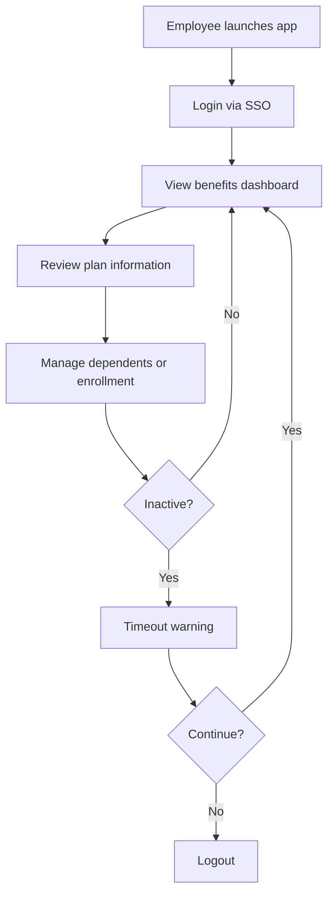

# User Flow

This diagram shows the user journey from login through benefits access and timeout handling.

```mermaid
flowchart TD
    A[Employee launches app] --> B[Login via SSO]
    B --> C[View benefits dashboard]
    C --> D[Review plan information]
    D --> E[Manage dependents or enrollment]
    E --> F{Inactive?}
    F -- No --> C
    F -- Yes --> G[Timeout warning]
    G --> H{Continue?}
    H -- Yes --> C
    H -- No --> I[Logout]
```
