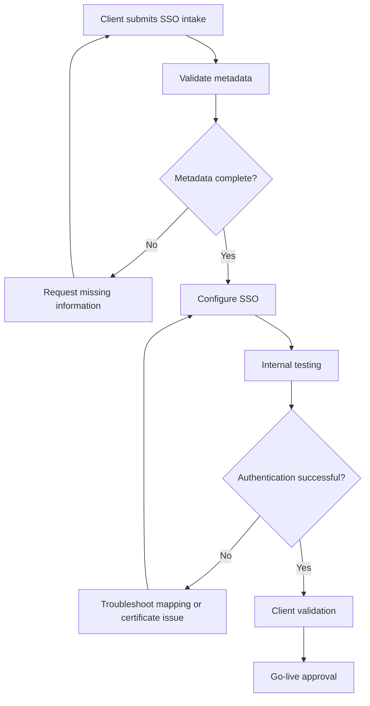

# SSO Flow

This diagram shows a repeatable SSO onboarding workflow for enterprise SaaS clients.

```mermaid
flowchart TD
    A[Client submits SSO intake] --> B[Validate metadata]
    B --> C{Metadata complete?}
    C -- No --> D[Request missing information]
    D --> A
    C -- Yes --> E[Configure SSO]
    E --> F[Internal testing]
    F --> G{Authentication successful?}
    G -- No --> H[Troubleshoot mapping or certificate issue]
    H --> E
    G -- Yes --> I[Client validation]
    I --> J[Go-live approval]
```
